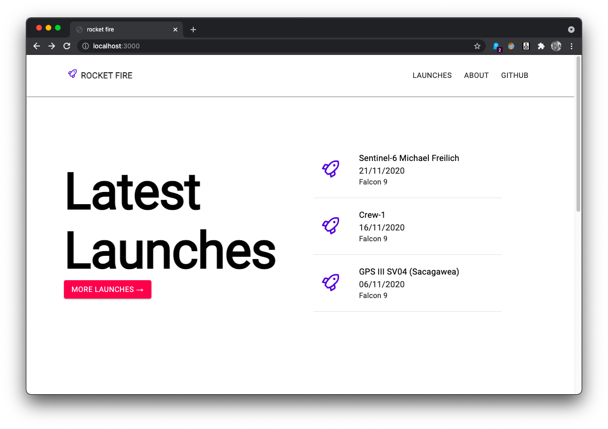

# 🚀 rocket fire

Demo project using [next.js](https://nextjs.org) & [SpaceX unofficial GraphQL API](https://api.spacex.land/graphql).




### Tech stack

* [next.js](https://nextjs.org)
* [react](https://reactjs.org)
* [apollo](https://apollographql.org)
* [unicons](https://iconscout.com)
* [material-ui](https://material-ui.com)
* [emotion](https://emotion.sh)

## Get started

### (Clone this repository first)

```sh

# Install dependencies

yarn

  

# Start dev server

yarn dev

  

# Start tests (or yarn test --watch for watch mode)

yarn test

  

# Lint (the dot is important)

yarn lint .

```

## Exercise

Using this NextTS Boilerplate and <https://api.spacex.land/graphql/> :

**Create a homepage that list the 3 last Space X Launch.**

**Each of them has a link to a detail page with those properties :**

 1. Mission Name
 2. Launch Date
 3. Rocket Name
 4. An embedded videa of the launch

## Requirements

Just fork this repository, and commit your code in your own github repository:)
